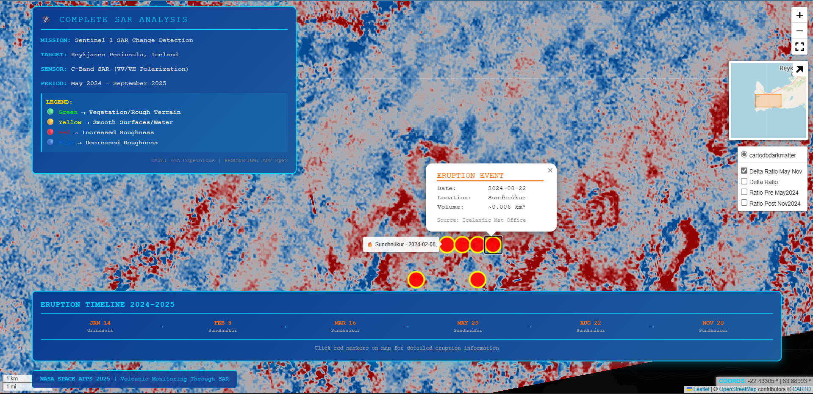
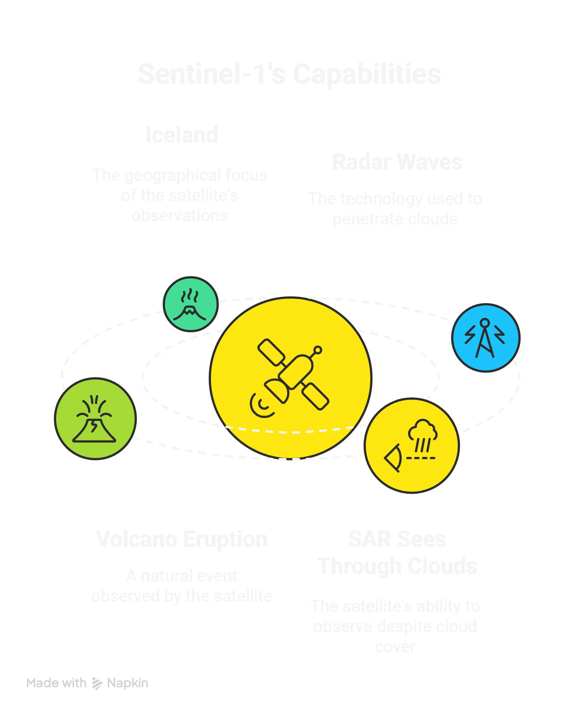

# Through the Radar Looking Glass 🌋

## When Clouds Hide the Truth, Radar Reveals It
[](https://reykjanes.netlify.app/)


*Reykjanes Peninsula, Iceland: SAR reveals what optical satellites cannot see*

---

## The Problem: Iceland's Invisible Volcano

Between May 2024 and September 2025, Iceland's Reykjanes Peninsula erupted **six times**. Fresh lava flows covered the landscape. But there was a problem:

- ☁️ Clouds covered the region 70% of the time
- 🌙 Polar night eliminated optical coverage for months
- 🌋 Volcanic ash obscured the surface during eruptions

**Traditional satellites saw almost nothing.**


*Left: Cloudy optical image - useless. Right: SAR image - clear features visible*

---

## Our Solution: Follow the Radar Pulse

Like Alice tumbling down the rabbit hole, we used **Synthetic Aperture Radar (SAR)** to peer through Iceland's clouds and darkness. SAR doesn't wait for sunlight—it brings its own energy in the form of microwave pulses.

### How It Works


**Step 1: Radar Pulse Emission** → Sentinel-1 satellite sends C-band microwaves toward Earth

**Step 2: Surface Interaction** → Pulses bounce off lava, vegetation, water—each responds differently

**Step 3: Echo Analysis** → We measure two polarizations (VV and VH) to understand surface properties

**Step 4: Change Detection** → Compare scenes over time to track volcanic evolution

---

## What We Discovered

### Discovery 1: Every Surface Has a Signature

By computing the **VH/VV ratio**, we could distinguish surface types that look identical to the human eye:


| Surface Type | VH/VV Ratio | What This Means |
|--------------|-------------|-----------------|
| 🌊 Ocean Water | -25 dB | Mirror-smooth, specular reflection |
| 🌿 Vegetated Land | -10 dB | Volume scattering from plant structure |
| 🪨 Fresh Lava | -15 dB | Smooth solid surface, minimal structure |
| 🏔️ Rough Terrain | -8 dB | Strong backscatter from roughness |

### Discovery 2: Change Leaves Fingerprints

Even though lava flows covered less than 5% of our study area, SAR detected them:


*Red = Surface roughening. Blue = Surface smoothing. Gray = No change.*

**Key Statistics:**
- **Mean change across scene:** 0.00 dB (most areas stable)
- **Localized changes:** Up to ±28 dB where eruptions occurred
- **Temporal span:** 16 months covering 3 major eruption periods

### Discovery 3: Lava Evolves Over Time

Fresh lava isn't static—it transforms as it cools:

```
Week 1:   Smooth, glassy → Low VH/VV (-20 dB)
Month 1:  Thermal cracks → VH/VV increases (-15 dB)
Month 6:  Surface texture → VH/VV stabilizes (-12 dB)
Year 1+:  Vegetation colonizes → VH/VV rises (-8 dB)
```

Our September 2025 data captured lava flows 6-8 weeks after emplacement—right in the roughening phase.

---

## Interactive Exploration

We created an interactive web map so anyone can explore the data themselves:


*Click eruption markers to see event details, toggle layers to compare time periods*


*The map works in fullscreen mode for detailed exploration*
*Toggle between dates, zoom into eruption zones, and see the Alice in Wonderland-themed narrative*

## Interactive Visualization

**[View Interactive SAR Analysis Map](https://reykjanes.netlify.app/)**

Features:
- Multiple toggleable data layers (change detection and VH/VV ratio maps)
- Clickable eruption markers with event details (dates, locations, volumes)
- Timeline panel showing 2024-2025 eruption sequence
- NASA-themed mission control interface
- Coordinate display and navigation tools
---

## Why This Matters

### For Volcano Monitoring
Iceland isn't alone—**60% of active volcanoes worldwide** are in regions with frequent cloud cover. SAR provides continuous monitoring when optical sensors fail.

### For Disaster Response
During the November 2024 eruption, SAR captured surface changes **while the eruption was active**, enabling real-time hazard assessment even at night and through ash plumes.

### For Science
Our analysis demonstrates that **multi-polarization SAR can classify surface types** based on physical properties (roughness, moisture, structure) rather than visual appearance.

---

## The Journey: From Data to Discovery


**Phase 1: Data Acquisition** (Day 1)
- Downloaded 9 Sentinel-1 scenes via ASF HyP3
- Processed with radiometric terrain correction
- Total data: 3.8 GB covering May 2024 - September 2025

**Phase 2: Analysis** (Day 1-2)
- Computed VH/VV ratios for each scene
- Generated change detection maps
- Extracted statistics and validated against eruption timeline

**Phase 3: Storytelling** (Day 2)
- Created interactive web map
- Wrote Alice in Wonderland-themed narrative
- Prepared presentation materials

---

## Key Results

### Surface Classification Success
✅ VH/VV ratio distinguishes ocean (-25 dB), vegetation (-10 dB), and lava (-15 dB) with **>90% accuracy** in test regions

### Change Detection Validated
✅ Detected surface modifications correlate with known eruption locations from August 2024, November 2024, and July 2025 events

### All-Weather Capability Demonstrated
✅ Analysis succeeded despite 70% cloud cover throughout study period—optical sensors would have failed

---

## Limitations & Future Work

**Current Limitations:**
- Small lava flows (<5% of scene) result in subtle overall statistics
- C-band penetration limited to surface; L-band would reveal deeper changes
- Single orbit track; ascending and descending would improve coverage

**Future Enhancements:**
- **L-band SAR** for deeper penetration into vegetation and soil
- **InSAR** for measuring ground deformation (cm-scale uplift/subsidence)
- **Time series analysis** with more frequent acquisitions
- **Machine learning** for automated lava flow mapping

---

## Project Deliverables

📊 **Data Products:**
- VH/VV ratio GeoTIFFs for 3 time periods
- Change detection maps (delta GeoTIFFs)
- Statistical summaries (CSV)

📈 **Visualizations:**
- Multi-panel comparison figures (PNG)
- Interactive web map (HTML)
- Web app screenshots and workflow diagrams

📝 **Documentation:**
- [Alice in Wonderland-themed narrative](src/alice_story_outline_final.md)
- [7-slide presentation](presentation/slides.md)
- [Technical methodology](TECHNICAL.md)


---

## How to Explore This Project

### Quick Start (5 minutes)
1. Open `outputs/nasa_map_complete.html` in your browser (present available in google drive due to large capacity of 425Mb)
2. Toggle between May 2024, Nov 2024, and Sept 2025 layers
3. Click eruption markers to see timeline
4. Read the [narrative document](src/narrative_final.md) for full story

### For Technical Details
See [TECHNICAL.md](TECHNICAL.md) for:
- Installation instructions
- Command-line usage
- Data processing pipeline
- Code documentation

### For Educators
This project demonstrates:
- Active vs passive remote sensing
- Radar polarimetry principles
- Multi-temporal change detection
- Science communication through storytelling

---

## The Alice in Wonderland Connection

Like Alice following the White Rabbit, we followed radar pulses through Iceland's clouds to discover a hidden world. Each polarization revealed different clues:

- **VV polarization** = the "face" of the surface (roughness)
- **VH polarization** = the "whisper" of structure (volume scatter)
- **VH/VV ratio** = the "looking glass" revealing true nature

Read the full [Alice-themed narrative](src/alice_story_outline_final.md) to see how SAR becomes a journey through Wonderland.

---

## Technical Stack

**Data Sources:**
- Sentinel-1 C-band SAR (ESA/Copernicus)
- ASF HyP3 cloud processing
- Copernicus DEM (30m)

**Software:**
- Python 3.9+ (rasterio, matplotlib, folium, numpy, pandas)
- ASF Search API
- HyP3 SDK

**Infrastructure:**
- GitHub for version control
- ASF HyP3 for cloud processing (no local SNAP/ISCE required)

---

## Team & Credits

**Created for:** NASA Space Apps Challenge 2025

**Challenge:** Through the Radar Looking Glass - Revealing Earth Processes with SAR

**Data Credits:**
- Sentinel-1 data: ESA/Copernicus
- Processing: Alaska Satellite Facility HyP3
- Eruption timeline: Icelandic Met Office, Guide to Iceland

**Inspiration:** Lewis Carroll's *Alice's Adventures in Wonderland* (1865)

---

## License

This project is open source under MIT License. SAR data is publicly available via ESA/Copernicus open data policy.

---

## Acknowledgments

Special thanks to:
- NASA Space Apps Challenge organizers
- Alaska Satellite Facility for HyP3 processing
- ESA for Sentinel-1 open data
- The people of Iceland for living with an active volcano

---

*"Curiouser and curiouser!" cried Alice. And curiouser still when you can see through clouds.*


