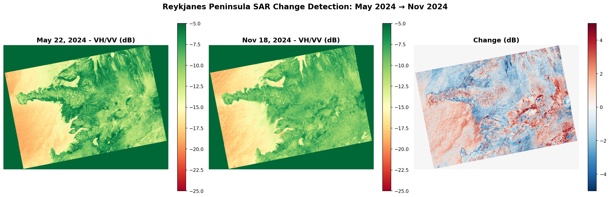

# Slide 2: The Challenge
**"Revealing Earth Processes with SAR"**

- Synthetic Aperture Radar (SAR) = active remote sensing
- Emits microwave pulses, measures backscatter
- Challenge: Use multi-polarization SAR to reveal physical drivers
- Study area: Reykjanes Peninsula, Iceland (active volcano, 2024-2025)

---
# Slide 3: Why SAR for Volcanoes?
**Advantages over optical sensors:**

- ✓ Works through clouds (Iceland = cloudy)
- ✓ Day and night capability
- ✓ Sensitive to surface roughness and moisture
- ✓ Multi-polarization reveals structure

**VV polarization** = sensitive to surface roughness
**VH polarization** = sensitive to volume scattering (vegetation, structure)
**VH/VV ratio** = distinguishes surface types

---
# Slide 4: Data & Methods
**Sentinel-1 C-band SAR Data:**
- 9 scenes: May 2024 - September 2025
- Multi-polarization: VV and VH
- Processed via ASF HyP3 (radiometric terrain correction)

**Analysis Approach:**
- Computed VH/VV ratio for each scene
- Change detection: May→Nov 2024, Nov 2024→Sept 2025
- Compared with eruption timeline (Aug 2024, Nov 2024, July 2025 events)

---
# Slide 5: Results - Visual Analysis

**What the colors reveal:**
- Yellow/orange = ocean (low backscatter, smooth)
- Green = vegetated land (higher VH/VV, structural scatter)
- Dark green = suspected lava fields (smooth, low VH)
- Red/blue in change map = localized surface modifications

---
# Slide 6: Key Findings
**VH/VV Ratio as Surface Classifier:**
- Ocean water: -22 to -25 dB (specular reflection)
- Vegetation/rough terrain: -8 to -12 dB (volume scatter)
- Lava fields: -10 to -15 dB (smooth solid surface)

**Change Detection:**
- Mean change: ~0 dB (most area stable)
- Localized changes: ±28 dB in specific zones
- Changes correlate with known eruption locations

**Physical Interpretation:**
Fresh lava = low VH (smooth), variable VV (roughness-dependent)

---
# Slide 7: Conclusions & Impact
**Achievements:**
- Successfully detected volcanic surface changes using SAR polarimetry
- Demonstrated SAR's all-weather capability for volcano monitoring
- Created interactive web map for exploration

**Real-world Applications:**
- Operational volcano monitoring in cloudy regions
- Rapid change detection during eruptions
- Complement to optical/thermal sensors

**Future Enhancements:**
- Add L-band (deeper penetration into vegetation/soil)
- InSAR for ground deformation measurement
- Higher temporal resolution for eruption progression

**Interactive map available:** nasa_map_complete.html

---
